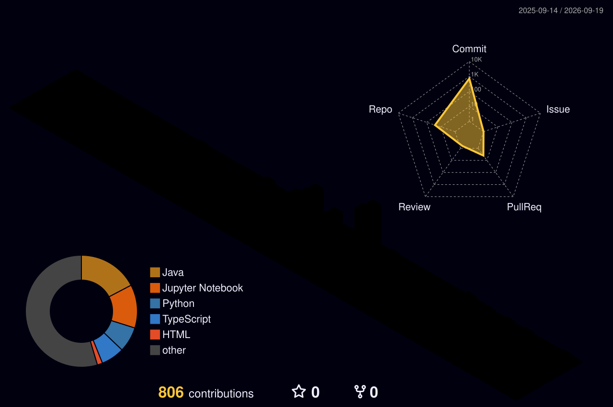

---- 
 

----

----

----

## About Me

✧ AI & Data Analytics enthusiast  
✧ Passionate about turning **data into intelligent solutions**  
✧ Working with **Python, Machine Learning, and Data Analysis**  
✧ Currently learning **Advanced Algorithms, Operating Systems & Software Engineering**  
✧ Exploring **AI, Agentic Systems, and Data Science Projects**  
✧ Fun fact: I love building **interactive developer tools and futuristic dashboards**

----
## Skills

----

## Most Used Languages

  <picture>
    <source media="(prefers-color-scheme: dark)" 
      srcset="https://github-readme-stats-fast.vercel.app/api/top-langs/?username=fnz78&layout=compact&langs_count=10&hide_border=true&bg_color=000000&title_color=FFFFFF&text_color=FFFFFF&cache_seconds=60"/>
    <source media="(prefers-color-scheme: light)" 
      srcset="https://github-readme-stats-fast.vercel.app/api/top-langs/?username=fnz78&layout=compact&langs_count=10&hide_border=true&bg_color=FFFFFF&title_color=000000&text_color=000000&cache_seconds=60"/>
    
  </picture>

----

## Streak

  <picture>
    <!-- Dark Mode -->
    <source
      media="(prefers-color-scheme: dark)"
      srcset="https://streak-stats.demolab.com?user=fnz78&theme=dark&hide_border=true&background=000000&ring=FFFFFF&fire=FFFFFF&currStreakNum=FFFFFF&currStreakLabel=FFFFFF&sideNums=FFFFFF&sideLabels=FFFFFF&dates=AAAAAA&stroke=FFFFFF" />
    <!-- Light Mode -->
    <source
      media="(prefers-color-scheme: light)"
      srcset="https://streak-stats.demolab.com?user=fnz78&theme=default&hide_border=true&background=FFFFFF&ring=000000&fire=000000&currStreakNum=000000&currStreakLabel=000000&sideNums=000000&sideLabels=000000&dates=666666&stroke=000000" />
    <!-- Fallback -->
    
  </picture>

----

## GitHub Stats

  <picture>
    <source media="(prefers-color-scheme: dark)" 
      srcset="https://github-readme-stats-sigma-five.vercel.app/api?username=fnz78&show_icons=true&hide_border=true&bg_color=000000&title_color=FFFFFF&text_color=FFFFFF&icon_color=FFFFFF"/>
    <source media="(prefers-color-scheme: light)" 
      srcset="https://github-readme-stats-sigma-five.vercel.app/api?username=fnz78&show_icons=true&hide_border=true&bg_color=FFFFFF&title_color=000000&text_color=000000&icon_color=000000"/>
    
  </picture>

----

## Contribution Snake

----
##  GitHub Activity Graph

  <picture>
    <source media="(prefers-color-scheme: dark)" 
      srcset="https://github-readme-activity-graph.vercel.app/graph?username=fnz78&bg_color=000000&color=FFFFFF&line=FFFFFF&point=AAAAAA&area=true&hide_border=true"/>
    <source media="(prefers-color-scheme: light)" 
      srcset="https://github-readme-activity-graph.vercel.app/graph?username=fnz78&bg_color=FFFFFF&color=000000&line=000000&point=555555&area=true&hide_border=true"/>
    
  </picture>

----

##  3D Contributions

  

----

##  Connect With Me

----
